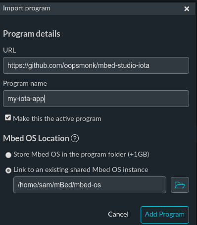
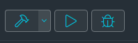
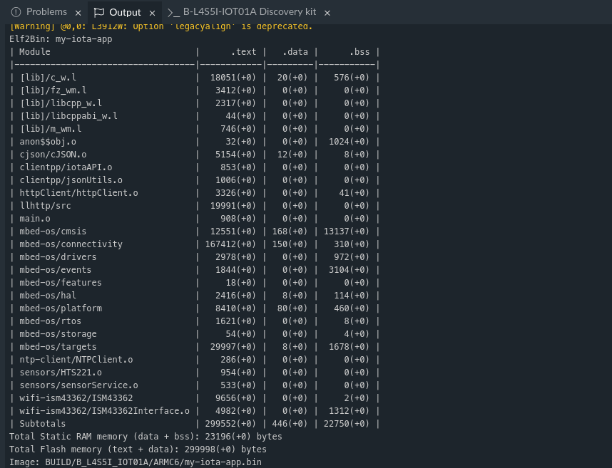
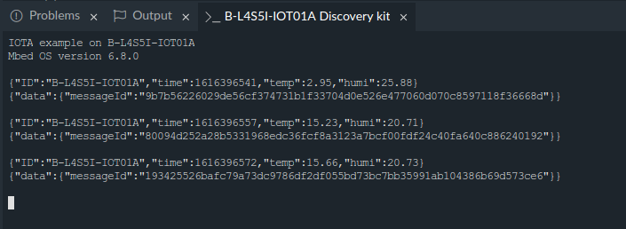
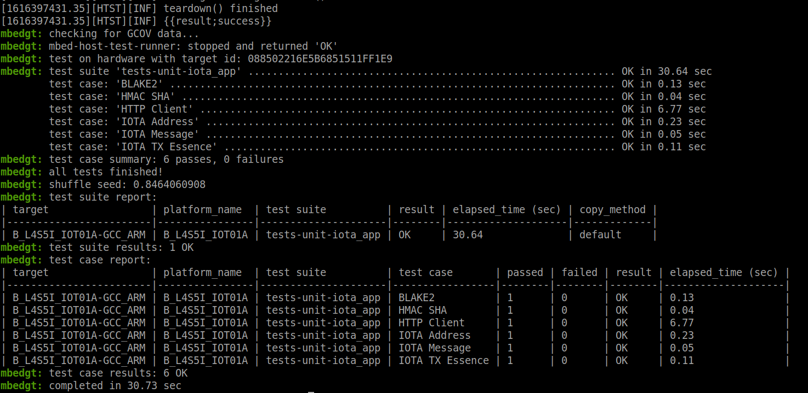

# mbed iota example

An IOTA C Client application with B-L4S5I-IOT01A using Mbed Studio IDE.

# Requirements 

* [Mbed Studio](https://os.mbed.com/studio/)
* [Mbed CLI](https://os.mbed.com/docs/mbed-os/v6.9/build-tools/install-and-set-up.html)
* [B-L4S5I-IOT01A](https://www.st.com/en/evaluation-tools/b-l4s5i-iot01a.html)

# Building Application

This project can be directly imported via Mbed Studio.

## Importing

1. Open the `File` menu and select `Import Program...` 
2. fill-in the URL of this project 




## Configuration

Setup your WiFi configuration and the node endpoint for connecting to WiFi and the Tangle network.

```
        "wifi-ssid": {
            "help": "WiFi SSID",
            "value": "\"SSID\""
        },
        "wifi-password": {
            "help": "WiFi Password",
            "value": "\"PWD\""
        },
        "wifi-security": {
            "help": "Options are NSAPI_SECURITY_WEP, NSAPI_SECURITY_WPA, NSAPI_SECURITY_WPA2, NSAPI_SECURITY_WPA_WPA2",
            "value": "NSAPI_SECURITY_WPA_WPA2"
        },
        "host": {
            "help": "IOTA node hostname",
            "value": "\"api.lb-0.testnet.chrysalis2.com\""
        },
        "port":{
            "help": "IOTA Client API port number",
            "value": "443"
        },
```

## Flashing application to target

Connect B-L4S5I-IOT01A with USB cable and run the application.

1. Building application





2. Monitoring via Serial Monitor



# Unit tests

Using Mbed CLI to run unit tests on the dev board.

```
$ mbed test -t GCC_ARM -m auto -v -n tests-unit-iota_app
```


